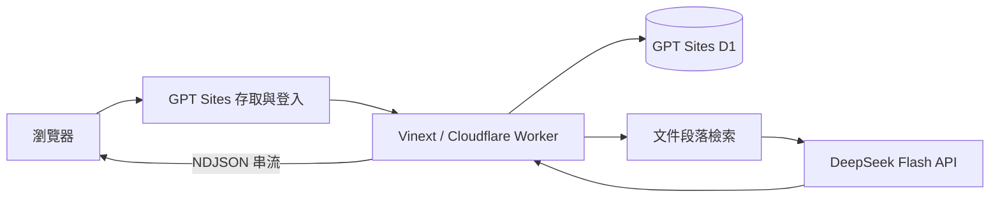

# 系統架構

## 資料路徑

`db/raw.ts` 取得 Sites 注入的 DB binding。API 使用 D1 prepared statements，值透過 bind 傳入；多語句操作透過 batch 原子提交。資料庫綱目位於 `db/schema.ts`，正式 migrations 位於 `drizzle/`，只在發布階段套用。

生成 AI 回覆期間不占用資料庫交易。生成完成後，一個 batch 依序新增 user、assistant 及合法引用，以資料庫內 MAX(message_no)+1 取得序號；D1 序列化写入並在失敗時整批回滾。並行保存由隔離 D1 測試驗證。

`/api/data` 回傳八表可見快照，個人 User、Conversation、Message、MessageCitation 依登入身分隔離；其餘為共享資料。`/api/chat` 回傳該段對話更新。草稿及捲動位置只保留頁面內記憶體，D1 是歷史資料的持久來源。

## 程式責任

| 檔案 | 責任 |
| --- | --- |
| app/chatgpt-auth.ts | 受信任的 Sites 登入身分 |
| lib/server.ts | 同源、登入、擁有者驗證及錯誤映射 |
| db/raw.ts | D1 binding |
| db/schema.ts | 八表 SQLite 綱目 |
| lib/retrieve.ts | 文件分段搜尋及排序 |
| lib/deepseek.ts | 提示、歷史预算、SSE 與引用選擇 |
| lib/chat-client.ts | NDJSON client 解析 |
| lib/models.ts | DeepSeek 初始化與歷史助理相容 |

## 邊界

本機 D1 是獨立副本，正式資料由 Sites 管理。正式部署保留既有存取權與登入，不應將 Sites 身分標頭直接信任於其他公開主機。已停用 PostgreSQL；postgres/ 和相關工具僅保留歷史記錄，不在目前執行路徑。
