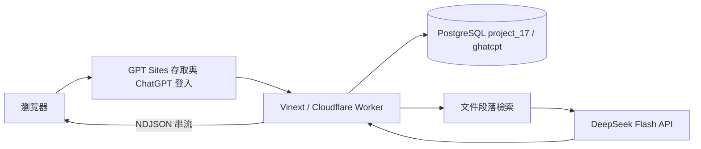

# 系統架構

## 程式責任

| 檔案 | 責任 |
| --- | --- |
| app/page.tsx | 聊天、歷史、工作空間、表單、帳號選單 |
| components/chat-workspace.tsx | 串流狀態、輸入框、捲動、來源、模型選單 |
| components/message-content.tsx | 安全 Markdown 顯示 |
| app/chatgpt-auth.ts | 讀取 Sites 提供的受信任身分標頭 |
| lib/server.ts | 登入／同源驗證、User 同步、對話擁有者、錯誤映射 |
| db/raw.ts | 由 runtime env 建立 PostgreSQL 設定 |
| db/postgres.ts | 參數化查詢、連線清理、多語句交易及對話 row lock |
| db/schema.ts | PostgreSQL Drizzle 綱目，與原 ERD 一致 |
| lib/retrieve.ts | 重疊段落搜尋與來源排序 |
| lib/deepseek.ts | system 提示、歷史預算、SSE、provider 錯誤、引用選擇 |
| lib/chat-client.ts | NDJSON client 解析與回覆完成事件 |
| lib/models.ts | 內建模型初始化及歷史助理相容 |

## 連線與交易

不在全域持有已連線的 PostgreSQL Client 或 Pool。Workers socket 屬於建立它的 request，跨 request 重用會產生不合法 I/O。一次 `execute()` 建立單一連線並在 finally 關閉；`batch()` 的全部操作共用同一連線與 transaction。

`prepare().bind()` 的介面保留現有 route 呼叫方式，但 SQL 採 PostgreSQL 語法。`?` placeholder 會轉成 `$1...$n`；單引號／雙引號內文字不轉換，值永遠不拼接到 SQL。沒有 SQLite 方言或 D1 fallback。

聊天生成期間不佔用 DB transaction。完整生成後才取得 Conversation row lock，依序新增 user、assistant、citations；一個 batch 成功或全部回滾。DB 鎖僅序列化保存，不將不同使用者的 AI 請求鎖在一起。

## 資料讀取與前端狀態

`/api/data` 一次回傳八表可見快照；User、Conversation、Message、MessageCitation 依登入使用者隔離，其餘為共享資料。`/api/chat` 只回傳該段對話的更新，前端合併該對話資料。

草稿、捲動位置與 pending 狀態為目前頁面內記憶體；DB 是歷史對話與引用的唯一持久來源。串流中斷時重新讀取後端資料再判斷是否重送，以減少回覆已保存卻被誤當失敗的重複。

## Hosting 邊界

Sites 負責網站允許存取的人員與登入驗證；應用只接受 Sites 注入的身分標頭。Portable 本機伺服器先移除外來身分標頭，再注入本機模擬身分。將此 Worker 放到其他網域／平台之前，必須另行實作可信的驗證 gateway，不可直接信任任意訪客傳來的 `oai-authenticated-user-*`。

PostgreSQL migration 由 CLI 工具於部署前執行；應用啟動不做 CREATE / ALTER TABLE。Sites D1 功能已停用，原歷史 SQL 不再參與正式資料讀寫。
