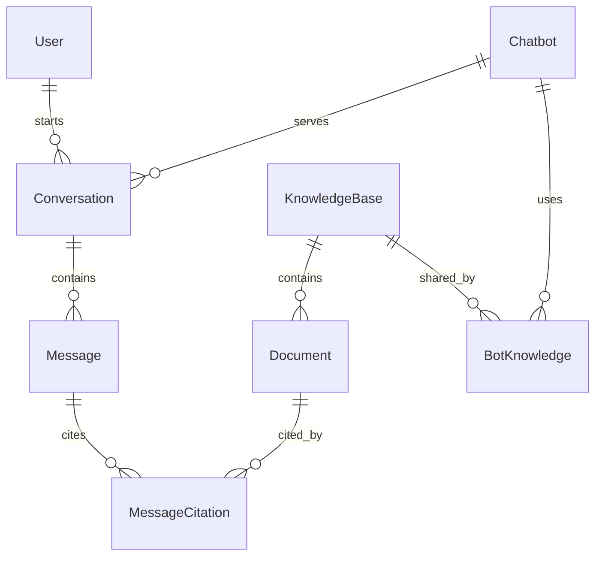

# PostgreSQL 資料庫與資料字典

DBMS：PostgreSQL 16.4。課程資料庫：`project_17`。業務綱目：`ghatcpt`。

原 `public` 已有其他課程資料，包含另一個 `User`。本系統獨立 schema 及限定 search_path，避免讀寫其他專案。新增 `ghatcpt_meta.migrations` 僅供 migration 追蹤，不是 ERD 的業務實體。

## 關係



原圖：[Chen ERD](../public/reference/erd.png)、[關聯綱目](../public/reference/schema.png)。

## 欄位

除特別說明外，全部業務欄位 NOT NULL。ID 為 text，保留既有登入主體／UUID／歷史 ID。

| Table | 欄位及型別 | PK | FK / 規則 |
| --- | --- | --- | --- |
| User | user_id text、name text、email text | user_id | email unique，trim(name) 非空 |
| Chatbot | bot_id text、name text、model_name text | bot_id | model_name 是 provider model 設定 |
| KnowledgeBase | kb_id text、name text、description text default '' | kb_id | 描述允許空字串 |
| Conversation | conversation_id text、user_id text、bot_id text、title text、created_at timestamptz default now() | conversation_id | user_id → User，bot_id → Chatbot，RESTRICT |
| Message | conversation_id text、message_no integer、role text、content text、sent_at timestamptz default now() | conversation_id + message_no | conversation_id → Conversation，CASCADE；序號 > 0；角色 user/assistant/system |
| Document | kb_id text、document_no integer、title text、source_url text default ''、content text | kb_id + document_no | kb_id → KnowledgeBase，RESTRICT；序號 > 0 |
| BotKnowledge | bot_id text、kb_id text | bot_id + kb_id | → Chatbot / KnowledgeBase，RESTRICT |
| MessageCitation | conversation_id text、message_no integer、kb_id text、document_no integer | 四欄 | 前兩欄 → Message（CASCADE）；後兩欄 → Document（RESTRICT） |

API 額外限制一般字串 300 字元、長內容 20,000 字元、序號為正 safe integer、來源 http(s)、email 格式及訊息角色。聊天輸入獨立上限 4000 字元。created_at / sent_at 對外正規化為 ISO 8601 UTC。

## 索引

| 索引 | 用途 |
| --- | --- |
| idx_user_email unique | 帳號 email 一致性 |
| idx_conversation_user | 個人歷史與擁有者檢查 |
| idx_conversation_bot | 模型統計／關聯查詢 |
| idx_conversation_created | 歷史時間查詢 |
| idx_botknowledge_kb | 知識庫連結查詢 |
| idx_citation_document | 文件引用量與完整性查詢 |

所有 PK 自帶 PostgreSQL 唯一索引；複合鍵順序與原綱目一致。

## Trigger

| Trigger | 觸發／拒絕条件 |
| --- | --- |
| citation_guard | 插入／修改引用時，訊息不是 assistant 或知識庫未連結 |
| message_role_guard | 將有引用的 assistant 訊息改成其他角色 |
| knowledge_link_guard | 刪除／更換仍被對話引用的 BotKnowledge |
| conversation_bot_guard | 將已有訊息的 Conversation 改 bot_id |

這些規則在 DB 執行，即使經 SQL 操作也生效。API 另外驗證個人對話擁有者。

## 建立與改版

有效綱目為 [db/schema.ts](../db/schema.ts)。

```sh
npm run db:generate
node --env-file=.env.local scripts/migrate-postgres.mjs
```

Drizzle 產生結構 migration 至 `postgres/migrations/`。`0001_integrity_rules.sql` 定義 PL/pgSQL trigger。Runner 以 advisory lock 序列化 migration，記錄檔名與 SHA-256，每份 migration 一個 transaction。已套用檔案若被更動，runner 拒絕執行；新增 schema 改動需新增 migration。

Schema migration 不放示範或回填資料；資料初始化／移轉是獨立操作。Drizzle metadata 記錄 Drizzle 所產生的結構 SQL，自訂 trigger migration 由本 runner 依檔名排序執行。

## 移轉

`scripts/import-d1-snapshot.mjs <private-snapshot.json>` 僅允許八個已知表與明確欄位，以 FK 順序匯入。目標業務表須為空，不自動覆蓋；原子 transaction 逐表檢查資料內容（時間欄位正規化），全部成功才提交。輸入快照留在 repo 外，不能提交 GitHub。

正式切換已保留原主鍵與引用關係。`scripts/refresh-system-docs.mjs` 只更新兩個已知教學文件內舊版架構描述；不改其他文件。舊歷史助理 ID 會改用 DeepSeek Flash，未被任何對話參照的旧設定才刪除。

## SQL 查驗範例

```sql
SELECT current_database(), version();
SELECT schemaname, tablename FROM pg_tables WHERE schemaname='ghatcpt';
SELECT COUNT(*) FROM ghatcpt."Conversation";
SELECT c.title, COUNT(m.message_no) AS messages
FROM ghatcpt."Conversation" c
LEFT JOIN ghatcpt."Message" m USING (conversation_id)
GROUP BY c.conversation_id,c.title;
```

應用目前不對 DB 建立每位使用者的 SQL 帳號或 RLS；個人資料範圍由已驗證的 API 強制套用。直接持有課程 DB 帳密者具備 DB role 所授權的 SQL 存取能力。
