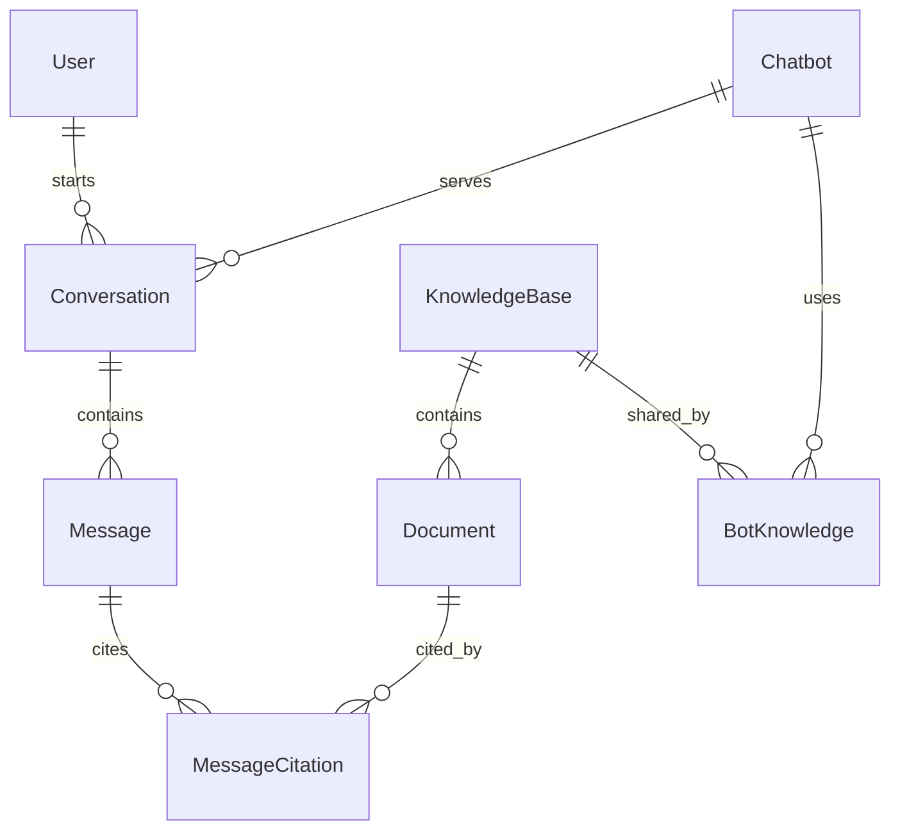

# D1 資料庫與資料字典

DBMS：Cloudflare D1（SQLite）。由 GPT Sites 管理，binding 為 `DB`。

目前正式系統使用下列八張業務表。Agent 執行相關資料表尚未實作。

## 關係



原圖：[Chen ERD](../public/reference/erd.png)、[關聯綱目](../public/reference/schema.png)。

## 欄位

除特別說明外，全部業務欄位 NOT NULL。ID 為 text，保留既有登入主體／UUID／歷史 ID。

| Table | 欄位及型別 | PK | FK / 規則 |
| --- | --- | --- | --- |
| User | user_id text、name text、email text | user_id | email unique，trim(name) 非空 |
| Chatbot | bot_id text、name text、model_name text | bot_id | model_name 是 provider model 設定 |
| KnowledgeBase | kb_id text、name text、description text default '' | kb_id | 描述允許空字串 |
| Conversation | conversation_id text、user_id text、bot_id text、title text、created_at text default CURRENT_TIMESTAMP | conversation_id | user_id → User，bot_id → Chatbot，RESTRICT |
| Message | conversation_id text、message_no integer、role text、content text、sent_at text default CURRENT_TIMESTAMP | conversation_id + message_no | conversation_id → Conversation，CASCADE；序號 > 0；角色 user/assistant/system |
| Document | kb_id text、document_no integer、title text、source_url text default ''、content text | kb_id + document_no | kb_id → KnowledgeBase，RESTRICT；序號 > 0 |
| BotKnowledge | bot_id text、kb_id text | bot_id + kb_id | → Chatbot / KnowledgeBase，RESTRICT |
| MessageCitation | conversation_id text、message_no integer、kb_id text、document_no integer | 四欄 | 前兩欄 → Message（CASCADE）；後兩欄 → Document（RESTRICT） |

API 額外限制一般字串 300 字元、長內容 20,000 字元、序號為正 safe integer、來源 http(s)、email 格式及訊息角色。聊天輸入獨立上限 4000 字元。created_at / sent_at 對外正規化為 ISO 8601 UTC。

## 索引

| 索引 | 用途 |
| --- | --- |
| idx_user_email unique | 帳號 email 一致性 |
| idx_conversation_user | 個人歷史與擁有者檢查 |
| idx_conversation_bot | 模型統計／關聯查詢 |
| idx_conversation_created | 歷史時間查詢 |
| idx_botknowledge_kb | 知識庫連結查詢 |
| idx_citation_document | 文件引用量與完整性查詢 |

所有 PK 由 SQLite 主鍵約束保證唯一；複合鍵順序與原綱目一致。

## Trigger

| Trigger | 觸發／拒絕条件 |
| --- | --- |
| citation_insert_guard / citation_update_guard | 插入／修改引用時，訊息不是 assistant 或知識庫未連結 |
| message_role_guard | 將有引用的 assistant 訊息改成其他角色 |
| knowledge_unlink_guard / knowledge_link_update_guard | 刪除／更換仍被對話引用的 BotKnowledge |
| conversation_bot_guard | 將已有訊息的 Conversation 改 bot_id |

這些規則在 DB 執行，即使經 SQL 操作也生效。API 另外驗證個人對話擁有者。

## 建立與改版

有效綱目為 db/schema.ts；使用 npm run db:generate 產生 SQLite migration 至 drizzle/。既有 0000、0001 migration 與 metadata 保持不變。Sites 在發布時自動套用未套用 migration；本機先 npm run build，再 npm run db:migrate。一般 API 不執行 CREATE / ALTER。

觸發器以 SQLite RAISE(ABORT) 阻止不合法引用與關聯修改。文件與知識庫分享規則維持原 ERD；同一操作的多筆寫入以 D1 batch 保證原子性。

## 查詢範例

```sql
SELECT COUNT(*) FROM "Conversation";
SELECT c.conversation_id,c.title,COUNT(m.message_no) AS messages
FROM "Conversation" c LEFT JOIN "Message" m USING (conversation_id)
GROUP BY c.conversation_id,c.title;
```

正式使用者查詢必須加上登入 user_id 範圍；上例供資料庫管理端理解。

## PostgreSQL 歷史

2026-10-06 依使用者要求停用 project_17 / ghatcpt，先核對並移回 D1，再刪除該 schema 中的八表。原 ghatcpt_meta.migrations 為歷史管理表，不屬於八表刪除範圍；public 其他專案保持原狀。
